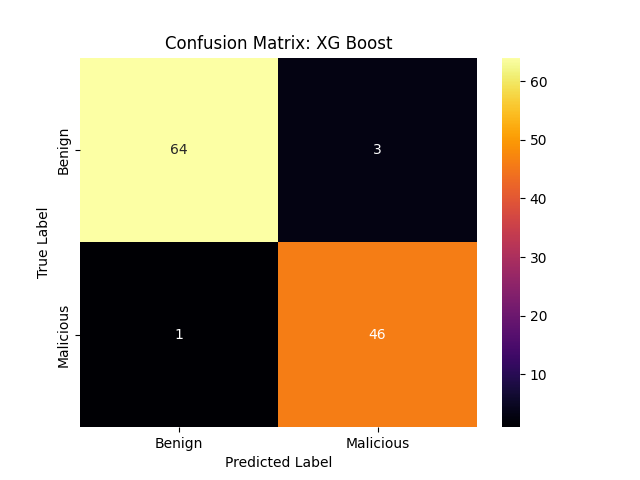
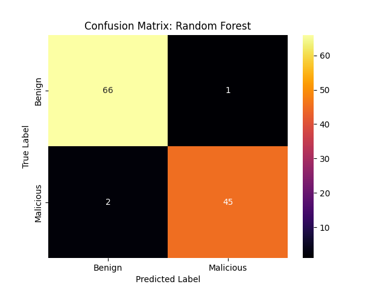
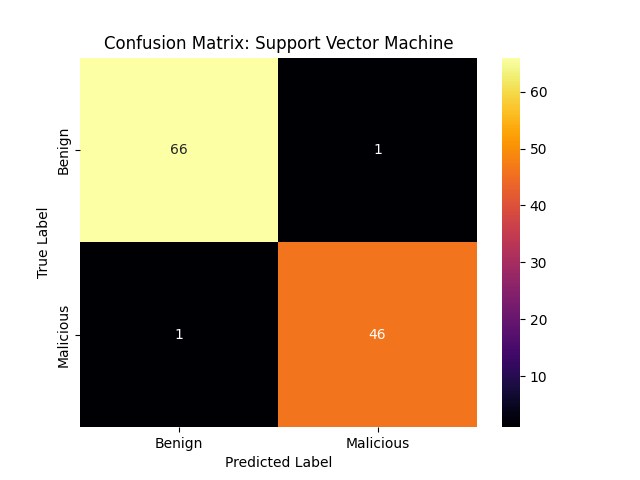
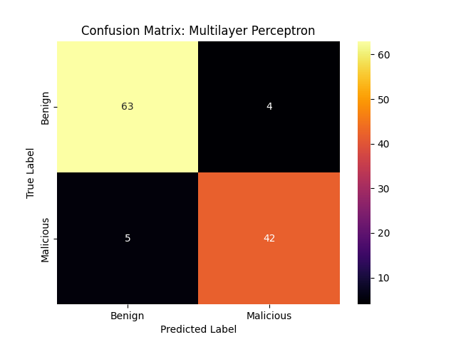

# Breast Cancer Wisconsin Diagnostic Dataset
Binary classification with mostly classical ML techniques
---
## Overview
This project explores the ["Breast Cancer Wisconsin Diagnostic Data Set"](https://www.kaggle.com/datasets/uciml/breast-cancer-wisconsin-data?resource=download).
The following techniques are explored:
- XG Boost
- Random forest
- Support Vector Machines
- Multi Layer Perceptron
and optimized with a Grid Search with Cross Validation.

## Implementation Details
XG Boost, Random Forest and Support Vector Machines are implemented with the Scikit-learn library. The models and a gridsearch with cross validation implementations from scikit-learn are used 
The Multi Layer Perceptron (MLP) is implemented in PyTorch to show a simple PyTorch implementation. A Dropout was added to the MLP, as it improved the results slightly.
For the MLP a custom Grid Search with cross validation, a dataset to store the data as tensors and a training/testing loop is implemented as the scikit-learn functions do not work on PyTorch models.
Also: the AdamW optimizer with L2-regularization is used to update the weights.

## Experiments
The following configurations were tested in a Grid Search
### XG Boost
- Number of estimators: 50, 100, 200, 300
- Max Depth: 2, 4, 6, 8
- alpha/L1 Regularization: 0, 0.5 1, 2, 5, 10
- learning rate: 0.01, 0.05, 0.1

### Random Forest
- Number of estimators: 50, 100, 200, 300
- Max Depth: 2, 4, 6, 8, unlimited
- Max Features: sqrt, log, unlimited

### Support Vector Machine
- kernel: Radial Basis Function, linear, Polynomial
- C/L2-Regularization: 0.1, 1, 2, 5, 10
- degree: 2, 3, 5 (only used for Polynomial)
- gamma: 0.001, 0.01, 0.1, 0.5, 1, 1/(n_features * X.var())

### Multi Layer Perceptron
- Learning Rate: 0.0001, 0.001, 0.005, 0.01, 0.05 
- Hidden Layers: [20], [50], [50, 50], [100], [100, 50], [20, 20, 20]

## Evaluation
The final model is chosen based on the result of the cross validated grid search.
### Final Parameters
**XG Boost**
The model parameters used for the final experiment were:
- alpha: 0
- learning rate: 0.1
- max depth: 4
- number of estimators: 200

**Random Forest**
The model parameters used for the final experiment were:
- max depth: 6
- max features: unlimited
- number of estimators: 50

**Support Vector Machine**
- C: 5
- Gamma: 0.01
- Kernel: Radial Basis Function

***Multi Layer Perceptron***
- Learning rate: 0.005
- Hidden Layers: [100]

### Results
| Model                      | Accuracy Score (Correct Guesses in %) | 
|:---------------------------|:-------------------------------------:|
| **XG Boost**               |                96.49%                 |
| **Random Forest**          |                97.37%                 |
| **Support Vector Machine** |                98.25%                 |
| **Multi Layer Perceptron** |                92.11%                 |

Most important measure is to keep the false negatives as low as possible, where both, the XG Boost and SVM model performed best (1 wrong guess of 47)
However, the SVM approach performed also has the lowest false positive rate, which makes this model the best working on these experiments.

